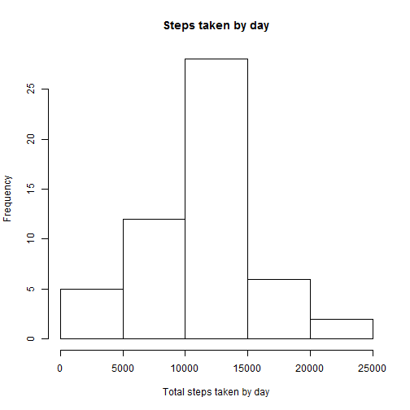
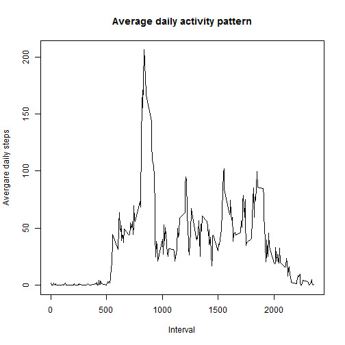
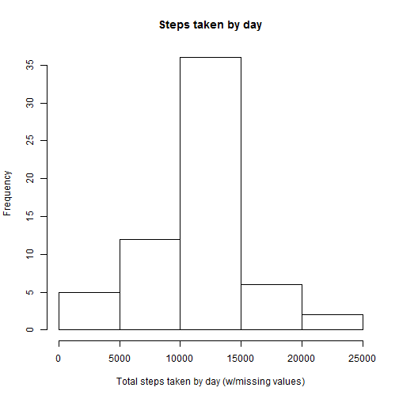

# Reproducible Research: Peer Assessment 1

## Init
Setting locale to English - United States

```r
Sys.setlocale(category = "LC_ALL", locale = "English_United States.1252")
```
## Loading and preprocessing the data

```r
unzip("activity.zip")
data <- read.csv("activity.csv", na.strings="NA")
```


## What is mean total number of steps taken per day?

```r
stepsByDate <- aggregate(steps ~ date, data, sum, na.rm=T )
hist(stepsByDate$steps, xlab="Total steps taken by day", main="Steps taken by day")
```

 

```r
q1.mean <- mean(stepsByDate$steps)
q1.median <- median(stepsByDate$steps)
```

Mean: 1.0766 &times; 10<sup>4</sup>  and median: 10765 for total number of steps taken by day

## What is the average daily activity pattern?

```r
stepsByInterval <- aggregate(steps ~ interval, data, mean, na.rm=T)
plot(stepsByInterval$interval, stepsByInterval$steps, type="l", xlab="Interval", ylab="Avergare daily steps", main="Average daily activity pattern")
```

 

```r
maxAverageSteps <- max(stepsByInterval$steps)
maxStepsInterval <- stepsByInterval[stepsByInterval$steps == maxAverageSteps,]$interval
```
Interval that contains max average number of steps: 835 (206.1698 average steps)

## Imputing missing values

```r
qNA <- length(data$steps[is.na(data$steps)])
```
Total number of missing values: 2304

The strategy selected to fill missing values is using average steps by interval for those missing intervals

```r
mData <- merge(data, stepsByInterval, by="interval", all=T)
completeMissingValues <- function(x, y) { if(is.na(x)) y else x}
mData$steps <- apply(mData, 1, function(row) completeMissingValues(row["steps.x"], row["steps.y"]))
newData <- mData[,c("steps", "date", "interval")]
newData$steps <- as.numeric(newData$steps)
newStepsByDate <- aggregate(steps ~ date, newData, sum, na.rm=T )
hist(newStepsByDate$steps, xlab="Total steps taken by day (w/missing values)", main="Steps taken by day")
```

 

```r
q3.mean <- mean(newStepsByDate$steps)
q3.median <- median(newStepsByDate$steps)
```
Mean: 1.0766 &times; 10<sup>4</sup>  and median: 1.0766 &times; 10<sup>4</sup> for total number of steps taken by day

Do these values differ from the estimates from the first part of the assignment?
Only median slightly differs

## Are there differences in activity patterns between weekdays and weekends?

```r
weekendDays <- c("Saturday","Sunday")
newData$day.type[weekdays(as.Date(newData$date, "%Y-%m-%d")) %in% weekendDays] <- "weekend"
newData$day.type[!weekdays(as.Date(newData$date, "%Y-%m-%d")) %in% weekendDays] <- "weekday"
newData$day.type <- as.factor(newData$day.type)
stepsByIntByDType <- aggregate(steps ~ day.type + interval, newData, mean, na.rm=T)

library(lattice)
xyplot(steps ~ interval | day.type, data=stepsByIntByDType, layout=c(1,2), type="l", ylab="Number of steps", xlab="Interval")
```

 

```r
stepsByIntByDTypeWE <- stepsByIntByDType[stepsByIntByDType$day.type == "weekend",]
weekend.maxAverageSteps <- max(stepsByIntByDTypeWE$steps)
weekend.maxStepsInterval <- stepsByIntByDTypeWE$interval[stepsByIntByDTypeWE$steps == weekend.maxAverageSteps ]

stepsByIntByDTypeWD <- stepsByIntByDType[stepsByIntByDType$day.type == "weekday",]
weekday.maxAverageSteps <- max(stepsByIntByDTypeWD$steps)
weekday.maxStepsInterval <- stepsByIntByDTypeWD$interval[stepsByIntByDTypeWD$steps == weekday.maxAverageSteps ]
```

Weekday maximum activity interval: 835 ( 230.3782 steps)

Weekend maximum activtiy interval: 915 ( 166.6392 steps)

Maximum activity is higher during weekdays and takes place a little bit earlier than weekends.


